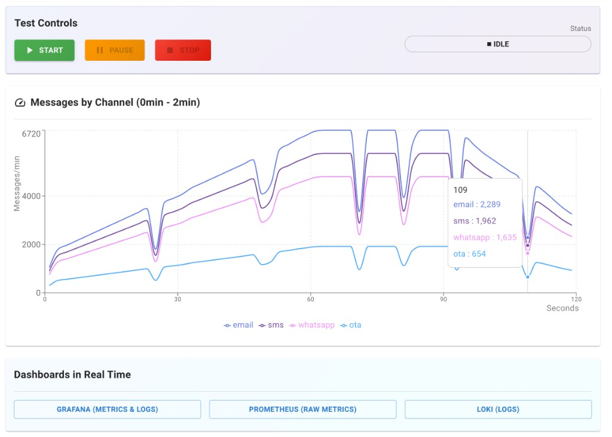
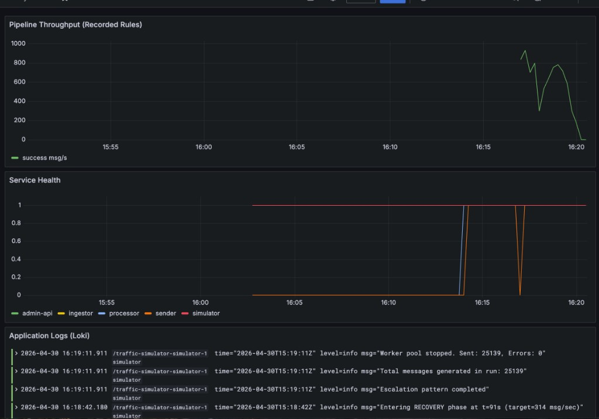

# Traffic Simulator

Proof of concept: distributed messaging pipeline with **DDD**, **event-driven architecture**, **observability**, and **controlled parallelism** in Go.

## Distributed Pipeline

```
simulator → ingestor → [NATS] → processor → [NATS] → sender → [NATS] → notification-service → template-service (HTTP /send)
         ... metrics / logs (Prometheus, Loki) run alongside the pipeline
```

**Key Characteristics:**

- **Event-driven** with at-least-once semantics
- **Bounded contexts** (DDD): Intake | Processing | Delivery
- **Idempotency** in DB via UPSERT + constraints
- **Observability** with Prometheus + Loki
- **Parallelism** with worker pools and semaphores
- **Graceful shutdown** in all goroutines

---

## Implemented Services

| Service                | Responsibility                                                                | Stack                                    |
| ---------------------- | ----------------------------------------------------------------------------- | ---------------------------------------- |
| `simulator`            | Generates load (80-320 msg/sec) with patterns                                 | **Go** + Worker Pool (10 workers)        |
| `ingestor`             | Receives `MessageIntent` via HTTP, publishes                                  | **Go** + DDD (Value Objects)             |
| `processor`            | Consumes events, persists in DB, publishes                                    | **Go** + Repository Pattern + Idempotent |
| `sender`               | Consumes `messages.processed`, publishes `messages.sent`                      | **Go** + ports/adapters                  |
| `admin-api`            | Proxies simulator control + exposes `/metrics`                                | **Go** HTTP                              |
| `notification-service` | Consumes `messages.sent`, fan-out to SMS/Email/WhatsApp in parallel           | **Go** + Fan-Out Pattern                 |
| `admin-ui`             | Simple dashboard to control simulation                                        | **React** + MUI                          |
| `template-service`     | Receives provider `/send` calls, validates payload, renders channel templates | **PHP** + Ports/Adapters + Value Object  |

---

## Design Patterns Implemented

**7 production-ready Go patterns (6 core + fan-out):**

1. **Dependency Injection + Factory** → Decoupling without framework
2. **Interface Segregation (Ports)** → Hexagonal architecture
3. **Repository Pattern** → Persistence abstraction with idempotency
4. **Value Objects + Smart Constructors** → Boundary validation
5. **Context-Based Lifecycle** → Elegant cancellation and timeouts
6. **Worker Pool Pattern** → Controlled parallelism (HTTP to ingestor)
7. **Fan-Out Pattern** → Parallel multi-target delivery with WaitGroup

**Advanced patterns (as implemented today):**

- **Simulator:** worker pool (10 workers) + bounded channel for HTTP sends to the ingestor
- **Processor:** **semaphore** (buffered channel) limits concurrent processing to 50 max (configurable)
- **Sender:** **semaphore** (buffered channel) limits concurrent sending to 50 max (configurable)
- **Notification-Service:** fan-out to SMS/Email/WhatsApp providers **in parallel** (WaitGroup pattern)
- **Template-Service (PHP):** ports/adapters + value object + use-case orchestrator for template rendering (`/send`)
- **State machine:** `status` column on `messages` (`processed_pending_publish` → `processed`)

**Complete documentation:** [`patterns-and-technical-learning.md`](patterns-and-technical-learning.md) — patterns walkthrough aligned with `src/`.

---

## Quality & Reliability

| Aspect                | Implementation                               |
| --------------------- | -------------------------------------------- |
| **Idempotency**       | UPSERT with `external_id` UNIQUE in DB       |
| **ACK/NAK**           | Manual in NATS with 10s timeout              |
| **Validation**        | JSON strict + body limit + schema validation |
| **Timeouts**          | 5s HTTP, 10s processing                      |
| **Graceful shutdown** | `WaitGroup` + context cancellation           |
| **Observability**     | Prometheus metrics + Loki structured logs    |

## Quick Start

### 1. Build & Run

```bash
docker compose up -d --build
```

Wait 5-10 seconds for all services to become ready. Verify:

```bash
docker compose ps
```

### 2. Start Simulation

**Simulator** (direct — default compose port **8081**):

```bash
# Start for 120 seconds (GET /start on the simulator)
curl "http://localhost:8081/start?duration=120"

curl http://localhost:8081/status

curl http://localhost:8081/stop
```

**Admin API** (proxy — compose port **8086**):

```bash
curl "http://localhost:8086/simulator/start?duration=120"
curl http://localhost:8086/simulator/status
curl http://localhost:8086/simulator/stop
```

Via **admin UI** (compose maps app to host **3001** — Grafana uses **3000**):

```
http://localhost:3001
```

Dashboard preview:



### 3. Monitor

**Prometheus:**

```
http://localhost:9090
```

- Query: `rate(simulator_messages_generated_total[1m])`
- Query: `rate(processor_messages_processed_total[1m])` or `processor_db_operations_total`

**Grafana:**

```
http://localhost:3001
```

Grafana dashboard with live pipeline data:



**Loki (Logs):**

```
http://localhost:3100
```

- Query: `{job="simulator"}` or `{job="processor"}`

---

## Testing

Unit tests per service:

```bash
# Ingestor (DDD + Value Objects)
cd src/ingestor && go test -v ./...

# Processor (Repository + Idempotency + semaphore)
cd src/processor && go test -v ./...

# Sender
cd src/sender && go test -v ./...

# Notification-service (Fan-Out)
cd src/notification-service && go test -v ./...

# Template-service (PHP)
cd src/template-service && composer test

# Simulator (Worker Pool)
cd src/simulator && go test -v ./...

# Admin API (HTTP handlers)
cd src/admin-api && go test -v ./...
```

**All Go modules in one go** (every package under `src/*` has tests; `go test ./...` must exit 0):

```bash
for d in src/ingestor src/processor src/sender src/notification-service src/simulator src/admin-api; do
  (cd "$d" && go test ./... -count=1) || exit 1
done
cd src/template-service && composer test
```

**Coverage** (each service is its own Go module — run from `src/<service>`):

```bash
cd src/ingestor && go test -cover ./...
# repeat for processor, sender, notification-service, simulator, admin-api
```

PHP service test command:

```bash
cd src/template-service && composer test
```

CI pipeline (GitHub Actions):

- Workflow file: `.github/workflows/ci.yml`
- Triggers: push and pull_request
- Jobs:
  - Go tests per module (`ingestor`, `processor`, `sender`, `notification-service`, `simulator`, `admin-api`)
  - PHP tests for `template-service` using Composer + PHPUnit

---

## Documentation

### Essential Reading

| Document                                                                       | Description                                                                                                         |
| ------------------------------------------------------------------------------ | ------------------------------------------------------------------------------------------------------------------- |
| **[`patterns-and-technical-learning.md`](patterns-and-technical-learning.md)** | Primary technical walkthrough: DDD, Go patterns, parallelism (worker pool, semaphore, fan-out), and lessons learned |
| [`docs/architecture.md`](docs/architecture.md)                                 | Architecture overview and bounded contexts                                                                          |
| [`docs/message-flow.md`](docs/message-flow.md)                                 | End-to-end message flow                                                                                             |
| [`docs/api-reference.md`](docs/api-reference.md)                               | HTTP endpoints and contracts                                                                                        |

### Specific Topics

| Document                                                 | Topic                                |
| -------------------------------------------------------- | ------------------------------------ |
| [`docs/concurrency.md`](docs/concurrency.md)             | Context, timeouts, graceful shutdown |
| [`docs/observability.md`](docs/observability.md)         | Prometheus, Loki, structured logs    |
| [`docs/simulator.md`](docs/simulator.md)                 | Load escalation patterns and tuning  |
| [`docs/traffic-dashboard.md`](docs/traffic-dashboard.md) | Grafana dashboards                   |
| [`docs/security.md`](docs/security.md)                   | Validation, limits, rate limiting    |

### Architecture Decision Records

- [`docs/adr/ADR-001-technology-choices.md`](docs/adr/ADR-001-technology-choices.md) — Go, NATS, PostgreSQL
- [`docs/adr/ADR-002-event-driven-architecture.md`](docs/adr/ADR-002-event-driven-architecture.md) — Why event-driven?
- [`docs/adr/ADR-003-worker-pools.md`](docs/adr/ADR-003-worker-pools.md) — Controlled parallelism
- [`docs/adr/ADR-005-postgres-schema.md`](docs/adr/ADR-005-postgres-schema.md) — Idempotent DB design
- [`docs/adr/ADR-006-observability-loki.md`](docs/adr/ADR-006-observability-loki.md) — Centralized logging

---

## Backlog & Next Steps

| Pattern                  | Why                                   | Priority        |
| ------------------------ | ------------------------------------- | --------------- |
| **Transactional Outbox** | Race condition between DB/NATS        | 🔴 CRITICAL     |
| **Error Classification** | ACK/NAK based on error type           | 🟡 IMPORTANT    |
| **Circuit Breaker**      | Protection against cascading failures | 🟡 IMPORTANT    |
| **Distributed Tracing**  | OpenTelemetry end-to-end              | 🟢 NICE-TO-HAVE |
| **Dead Letter Queue**    | Unrecoverable messages                | 🟢 NICE-TO-HAVE |
| **Schema Registry**      | Event versioning                      | 🟡 IMPORTANT    |

See details in [`patterns-and-technical-learning.md#gaps--technical-backlog`](patterns-and-technical-learning.md#gaps--technical-backlog).

---

## Learning Outcomes

After studying this project, you will understand:

✅ How to implement DDD in Go without framework  
✅ Event-driven architecture with at-least-once semantics  
✅ Practical idempotency in database  
✅ Three parallelism patterns: **Worker Pool** (simulator), **Semaphore** (processor/sender), **Fan-Out** (notification-service)  
✅ Context for elegant cancellation and timeouts  
✅ Observability with Prometheus + Loki  
✅ Graceful shutdown in distributed systems

---

## Tech Stack

**Languages:** Go, PHP, React  
**Message Broker:** NATS JetStream  
**Database:** PostgreSQL + pgx  
**Observability:** Prometheus, Grafana, Loki  
**Orchestration:** Docker Compose (local); Kubernetes manifests under `k8s/` (see `docs/adr/ADR-007-k3s-orchestration.md`)  
**Async Job Queue:** NATS (not separate worker)

---

## Current Limitations

- No transactional outbox (in backlog)
- No authentication/authorization (local/demo environment)
- No schema registry (hardcoded contracts)

---

## 🤝 How to Contribute

1. **Read** [`patterns-and-technical-learning.md`](patterns-and-technical-learning.md)
2. **Study** the code in `src/`
3. **Implement** backlog items
4. **Test** with `go test ./...`
5. **Document** decisions in `docs/adr/`

---

## References & Inspiration

**Patterns:**

- [Domain-Driven Design (Eric Evans)](https://domainlanguage.com/ddd/)
- [Hexagonal Architecture (Alistair Cockburn)](https://alistair.cockburn.us/hexagonal-architecture/)
- [Event Sourcing & CQRS (Fowler)](https://martinfowler.com/bliki/CQRS.html)

**Go & Concurrency:**

- [Context Package (Go Docs)](https://pkg.go.dev/context)
- [Concurrency Patterns in Go (Rob Pike)](https://go.dev/blog/pipelines)
- [Working with Errors (Go 1.13+)](https://go.dev/blog/go1.13-errors)

**Distributed Systems:**

- [Building Microservices (Martin Fowler)](https://martinfowler.com/articles/microservices.html)
- [Event-Driven Architecture (Confluent)](https://www.confluent.io/learn/event-driven-architecture/)
- [What do you mean by Event-Driven? (Martin Fowler)](https://martinfowler.com/articles/201701-event-driven.html)
- [Microservices on AWS](https://aws.amazon.com/microservices/)
- [Event-Driven Architecture on AWS](https://aws.amazon.com/event-driven-architecture/)

---

## 📄 License

MIT License — see [`LICENSE`](LICENSE).

---

**Last updated:** April 30, 2026  
**Maintained by:** Traffic Simulator Team
